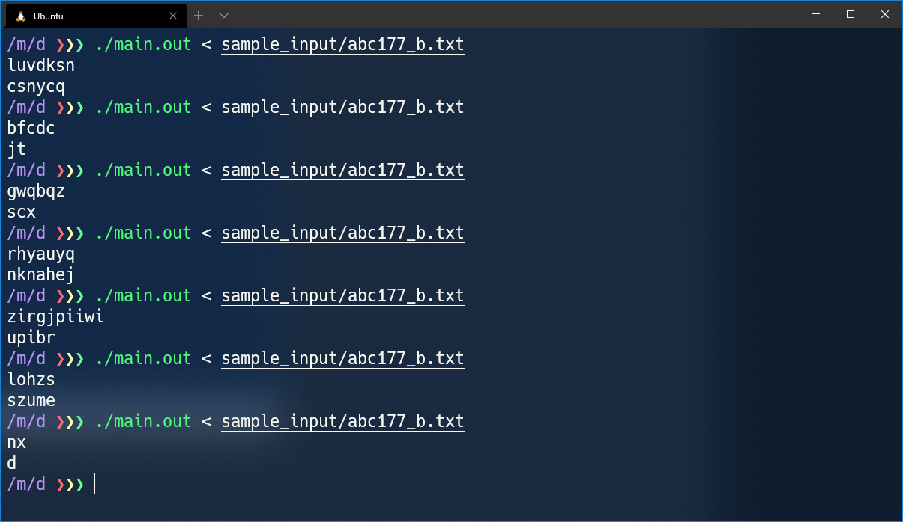
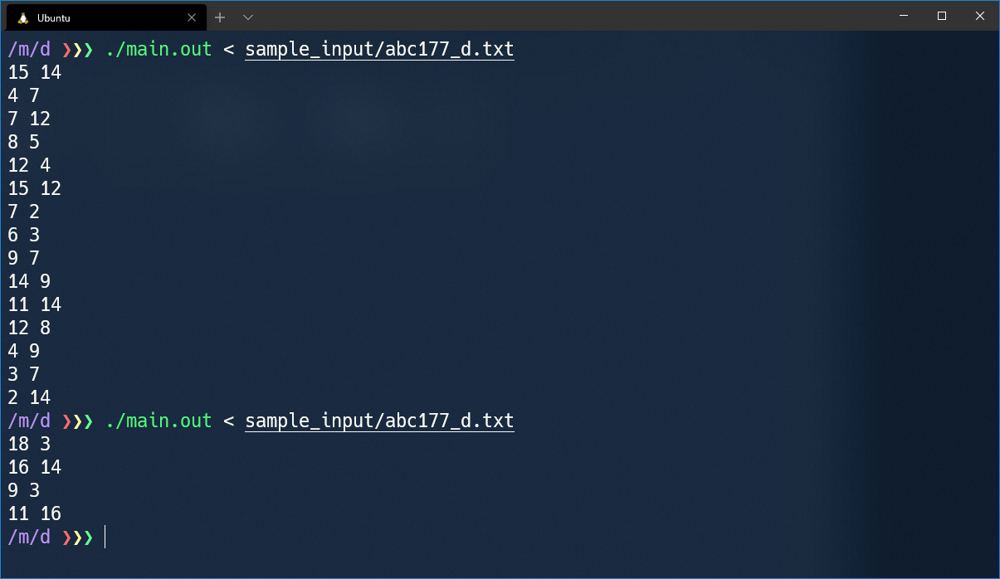
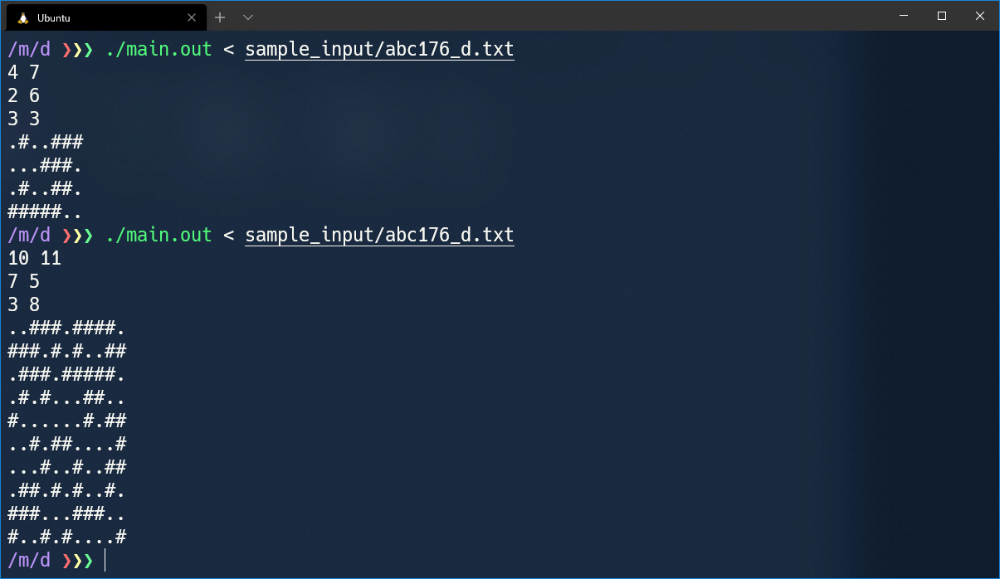
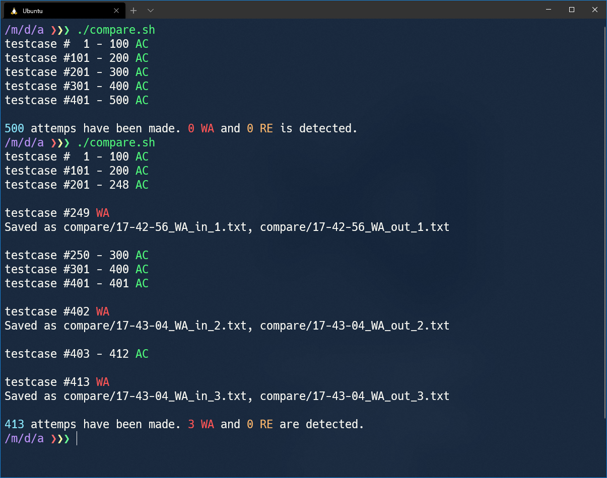
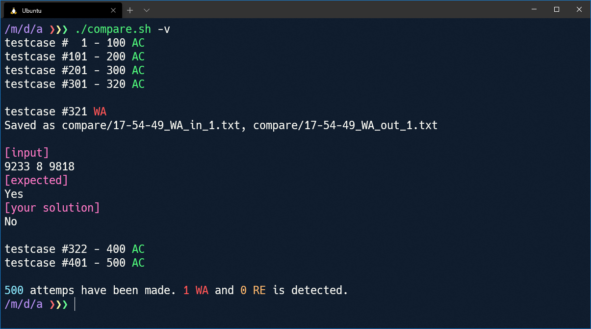
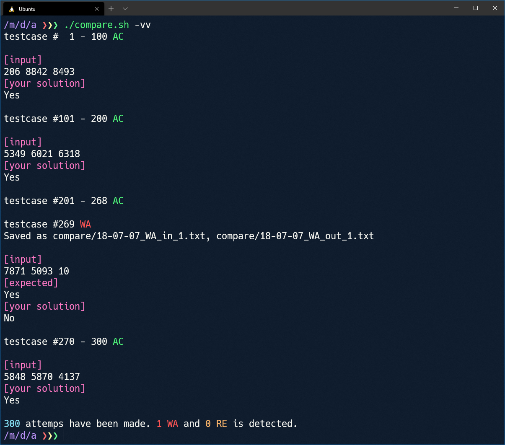
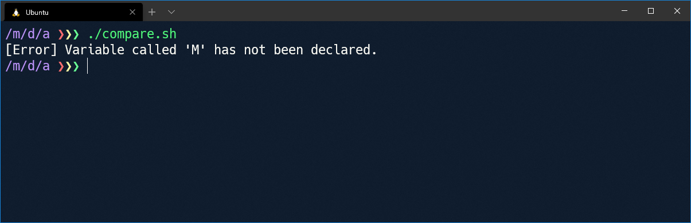

# これは何

競技プログラミング用のテストケース生成ツールです。ランダムな整数・文字列と、その配列を生成できます。

生成できる整数と文字は、それぞれお使いの環境の C++ の `long long` 型, `char` 型で扱えるものに限ります。

このツール自体は C++ で書かれていますが、競技プログラミングを C++ 以外の言語でやっている方も使用できます。

#### 例







テストケースを大量に生成して、2 つのプログラムを比較することも可能です。


# 使用方法 (1 つのテストケースを生成)

`main.cc` をコンパイルして、作成された実行可能ファイルを実行します。コンパイルには以下のコマンドを使用します。

```bash
g++ -std=c++17 main.cc
```

または

```bash
clang++ -std=c++17 main.cc
```

作成された実行可能ファイルにテストケースを指定するファイルを読ませると、テストケースが出力されます。

作成された実行可能ファイルの名前を `generator.out`, テストケースを指定するファイルの名前を `format.txt` とし、それらのファイルが配置されているディレクトリで現在作業中であるとします。このとき、テストケースを出力するには

```bash
./generator.out < ./format.txt
```

を実行します。

テストケースを指定するファイルの作成方法は [こちら](./doc/input_file_syntax.md) を参考にしてください。

# 使用方法 (たくさんのテストケースを生成し、WA になった解を愚直解と比較)

まず、上記の方法で 1 つのテストケースが生成できることを確認してください。

`compare.sh` をテキストエディタで開いて以下の部分を編集し、`compare.sh` を実行します。

- `testcase_generator=` に続く引用符の内側に、テストケースを出力するコマンドを入力します。
- `your_solution=` に続く引用符の内側に、愚直解と比較したい解を出力するコマンドを入力します。
- `naive_solution=` に続く引用符の内側に、愚直解を出力するコマンドを入力します。
- `max_number_of_attempts=` に続けて、何回の試行を行うかを正の整数で指定します。
- `max_number_of_WA_or_RE=` に続けて、何回の WA (不正解) または RE (実行時エラー) となる入力が見つかったら終了するかを正の整数で指定します。

このスクリプトは、

- 試行回数が `max_number_of_attempts` 回に達する
- WA または RE が合計 `max_number_of_WA_or_RE` 回検出される

の一方の条件が満たされた時点で終了します。

## 例 1

- テストケース生成プログラム (`main.cc` をコンパイルしたもの) が `./generator.out`
- テストケースを指定するファイル が `./format.txt`
- 愚直解と比較したい解が `./main.out`
- 愚直解が `./naive.out`
- 最大で 1000 回の試行を行う
- 3 つの WA または RE となる入力が検出されたとき、スクリプトの実行を終了する

という場合、`compare.sh` の初めの部分を以下のように編集します。

```bash
alias testcase_generator="./generator.out < ./format.txt"
alias your_solution="./main.out"
alias naive_solution="./naive.out"

declare -i max_number_of_attempts=1000
declare -i max_number_of_WA_or_RE=3
```

## 例 2

- テストケース生成プログラム (`main.cc` をコンパイルしたもの) が `~/programming/generator.out`
- テストケースを指定するファイル が `./in.txt`
- 愚直解と比較したい解が `./main.py` (これを Python 3 で実行する)
- 愚直解が `./naive.py` (これを Python 3 で実行する)
- 最大で 500 回の試行を行う
- 1 つの WA または RE となる入力が検出されたとき、スクリプトの実行を終了する

という場合、`compare.sh` の初めの部分を以下のように編集します。

```bash
alias testcase_generator="~/programming/generator.out < ./in.txt"
alias your_solution="python3 ./main.py"
alias naive_solution="python3 ./naive.py"

declare -i max_number_of_attempts=500
declare -i max_number_of_WA_or_RE=1
```

## 出力例



この例ではスクリプトを 2 回実行しています。1 回目の実行では 1 つも WA が検出されないまま 500 回の試行が終了し、2 回目の実行では 3 つの WA が検出されたことでスクリプトが終了しています。

テストケースの生成はランダムであるため、複数回実行した場合このように結果が異なることがあります。

WA となったときの入力と出力は、作業中のディレクトリの配下の `compare` というディレクトリの中に `時刻_WA_in_1.txt`, `時刻_WA_out_1.txt` のようなファイル名で保存されます。`compare` ディレクトリがない場合は自動で作成されます。

`./compare.sh -v` として実行すると、WA や RE が検出された場合にその結果をファイルに保存するだけでなく標準出力に出力します。



`./compare.sh -vv` として実行すると、2 つの解の出力が一致した場合についても 100 回に 1 回、その入力と出力を標準出力に出力します。



テストケースを指定するファイルの形式が正しくない場合、エラーメッセージが出力されてスクリプトは終了します。

```
variable
N int M 1000
M int 1 1000

format
N M
```



このスクリプトは「取りあえず動けばいい」というくらいのノリで作成されているので、何かトラブルが起きた場合に自分で問題を解決できる方のみ使用してください。

また、[こちら](./doc/warning.md) にその他の注意点を記載してあるので参考にしてください。
