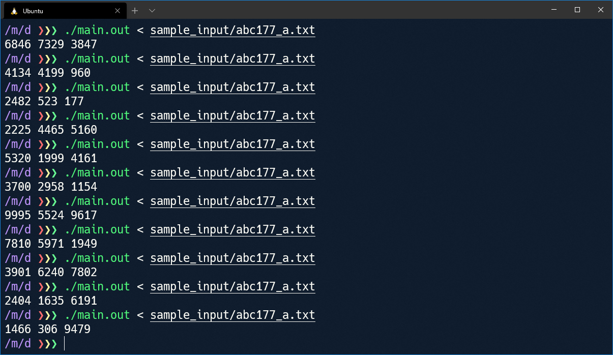
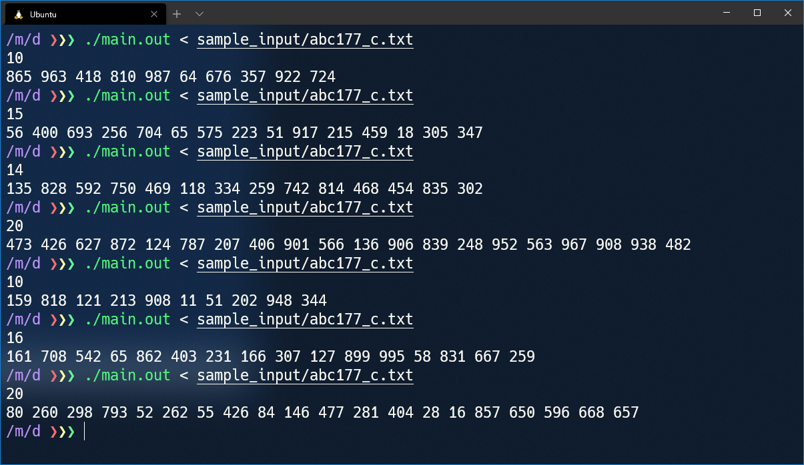
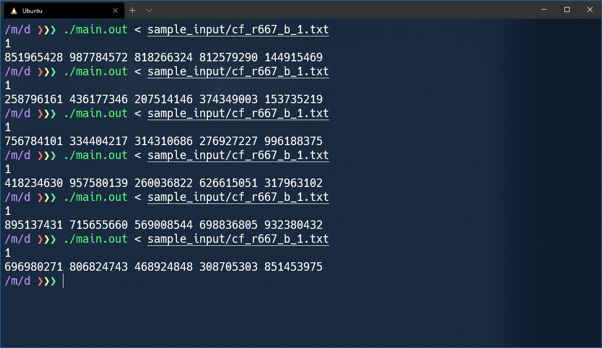
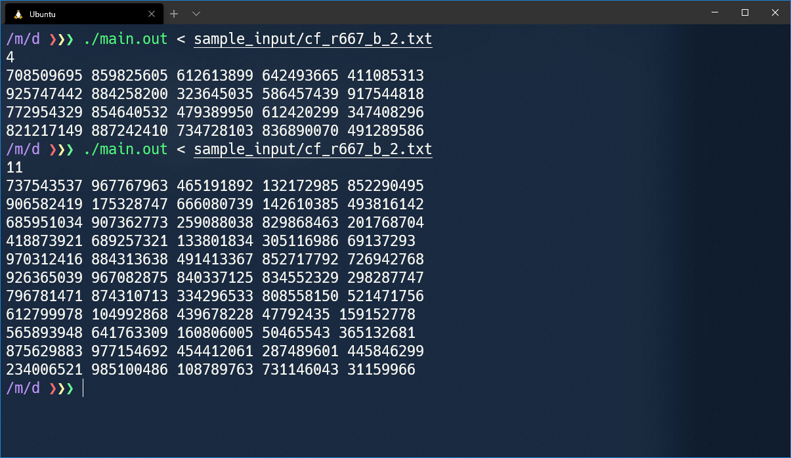

# テキストファイルの作成

テストケースの生成には、テストケースを指定する以下の形式のテキストファイルが必要です。

```
variable
(変数の宣言)

format
(形式の指定)
```

## 変数の宣言

`variable` という単語に続けて変数を宣言します。整数・文字列・配列を宣言できます。

### 整数の宣言

整数は以下の形式で宣言します。

```
変数名 int 最小値 最大値
```

例えば、`N` という 0 以上 100 以下の整数の宣言は

```
N int 0 100
```

とします。`最小値` と `最大値` には、既に宣言した変数を用いることができます。

```
A int 0 100  // A は 0 以上 100 以下の整数
B int A 100  // B は A 以上 100 以下の整数
C int 0 B    // C は 0 以上 B   以下の整数
```

`int`, `最小値`, `最大値` には、それぞれ括弧 `()` で囲まれたオプションを指定することができます。

```
変数名 int(オプション) 最小値(オプション) 最大値(オプション)
```

#### `int` のオプション

既に宣言した変数と違う値を生成するには、`!=` を指定します。

```
A int 0 100       // A は 0 以上 100 以下の整数
B int(!=A) 0 100  // B は 0 以上 100 以下で、A とは違う整数
```

同様に、`>`, `>=`, `<`, `<=` を指定することができます。

```
A int 0 100         // A は 0 以上 100 以下の整数
B int(>A) 20 100    // B は 20 以上 100 以下 かつ A より大きい 整数
C int(>=A) 30 100   // C は 30 以上 100 以下 かつ A 以上 の整数
D int(<A) -100 100  // D は -100 以上 100 以下 かつ A より小さい 整数
E int(<=A) 0 100    // E は 0 以上 100 以下 かつ A 以下 の整数
```

`a` で割って `b` 余る数 を生成するには、不等号のオプションに続けてカンマ (`,`) 区切りで `a%b` を指定します。

```
A int 0 100           // A は 0 以上 100 以下の整数
B int(!=A,1%2) 0 100  // B は 0 以上 100 以下で A と等しくない、2 で割ると 1 余る整数 (奇数)
C int(!=A,0%2) 0 100  // C は 0 以上 100 以下で A と等しくない、2 で割ると 0 余る整数 (偶数)
```

不等号のオプションを指定せず剰余のオプションのみを指定したいときにもカンマ (`,`) は省略できません。

```
A int(,5%13) 0 100  // A は 0 以上 100 以下で、13 で割ると 5 余る整数
```

#### `最小値`, `最大値` のオプション

`()` 内に数を入力することで、その分だけ数を増減できます。

```
N int 1 100(1)   // N は 1 以上 101 以下の整数
M int 1 100(-1)  // M は 1 以上 99  以下の整数
```

このオプションは、既に宣言した変数と組み合わせて使われることを想定しています。

```
A int 1 50
B int 100 200
C int A(1) B(-1)  // C は A+1 以上 B-1 以下 の整数 (C は A より大きく B より小さい 整数)
```

例えば以下のような宣言は正しいです。

```
N int 1 10000
M int -10000 N(-1)
Apple int(,3%5) 0 100
Banana_1 int(>Apple,1%10) 0 300
Zero int 0 0
```

### 文字列の宣言

文字列は以下の形式で宣言します。ただし、`使用する文字` に空白 や 改行文字 などの文字と ハイフン (`-`), カンマ (`,`), 角括弧 (`[`, `]`) を含めることはできません。(多分競プロではそんなに問題ない)

```
変数名 str[使用する文字] 最短の長さ 最長の長さ
```

例えば、`R`, `G`, `B` からなる 1 文字以上 10 文字以下の長さの文字列 `S` の宣言は

```
S str[RGB] 1 10
```

とします。

ASCIIコードが連続している文字たちは、`最初の文字-最後の文字` という記法でいっぺんに指定できます。

```
S str[a-z] 1 10  // S は 英小文字からなる 1 文字以上 10 文字以下 の文字列
```

複数の指定はカンマ (`,`) 区切りで行います。

```
T str[a-z,A-Z,.#] 1 100  // T は 英小文字, 英大文字, '.', '#' からなる 1 文字以上 100 文字以下 の長さの文字列
```

`最短の長さ`, `最長の長さ` に、既に宣言した変数を用いることも可能です。

```
N int 1 10
S str[a-z] N N  // S は 英小文字からなる N 文字以上 N 文字以下 (つまりちょうど N 文字)の文字列
T str[a-z] 1 N  // T は 英小文字からなる 1 文字以上 N 文字以下 の文字列
```

#### 文字列のオプション

文字列にも整数と同様のオプションが指定できます。ただし、剰余のオプションはありません。

```
変数名 str[使用する文字](オプション) 最短の長さ(オプション) 最長の長さ(オプション)
```

```
N int 1 10
S str[.#] 1 N(-1)              // S は'.', '#' からなる 1 文字以上 N 文字未満 の長さの文字列
my_str str[.#](!=S) 1 N(-1)    // my_str は '.', '#' からなる 1 文字以上 N 文字未満 の長さの S とは違う文字列
```

`>`, `>=`, `<`, `<=` のオプションでは、比較に[辞書式順序](https://ja.wikipedia.org/wiki/%E8%BE%9E%E6%9B%B8%E5%BC%8F%E9%A0%86%E5%BA%8F)が用いられます。

### 配列の宣言

以下の形式で、要素に整数または文字列をもつ配列を宣言することができます。

```
配列の名前 配列の種類 配列の要素数 配列の中身の宣言
```

`配列の種類` には、`vech` または `vecv` を指定します。前者は横にスペース区切りで、後者は縦に改行区切りで出力されます。

```
vech ('vec'tor printed 'h'orizontally)
1 2 3 0  // 横向き

vecv ('vec'tor printed 'v'ertically)
1
2
3
0  // 縦向き
```

`配列の中身の宣言` には配列の要素となる 整数 または 文字列 の宣言の、変数名を除いた部分を入力します。

```
X vech 5 int 1 10
         ^^^^^^^^ ここに配列の中身(整数)の宣言

Y vecv 6 str[AB] 1 10
         ^^^^^^^^^^^^ ここに配列の中身(文字列)の宣言
```

```
X の例:
1 3 8 5 2  // X は 1 以上 10 以下 の整数 が 5 個並んだ 横向き の配列

Y の例:
AABAB
ABBBBAB
BBAB
B
AABAABB
ABA  // Y は 1 文字以上 10 文字以下 の 'A', 'B' からなる文字列 が 6 個並んだ 縦向き の配列
```

`配列の中身の宣言` には整数や文字列に使えるオプションを指定することができます。配列の要素に比較のオプションを使用すると、配列の同じインデックスを持つ要素ごとの比較になります。要素数が違う配列同士を比較した場合にはエラーとなります。

```
// OK
A vech 10 int 1 100
B vech 10 int(!=A) 1 100

// OK
N int 1 10000
A vech N int 1 100
B vecv N int(>A) 1 100

// NG
A vech 10 int 1 100
B vech 100 int(!=A) 1 100
```

### 注意点

最小値・最大値を指定する変数に配列の名前を使った場合、配列の先頭の要素が参照される仕様になっています。

```
A vech 100 int 1 100       // A は 1 以上 100 以下 の整数 の配列

M int 1 A                  // A の先頭の要素が最大値になる
B vech 100 int 1 A         // A の先頭の要素が各要素の最大値になる
C vech 100 int(<=A) 1 100  // A の各要素がそれぞれの要素の最大値になる (要素ごとに最大値が変わる)
```

## 形式の指定

テストケースを指定するテキストファイルは、以下のような形式をしています(再掲)。

```
variable
(変数の宣言)

format
(形式の指定)
```

`format` という単語に続けて、AtCoder の「入力」のように宣言した変数を並べることでテストケースの形式を指定します。

## テキストファイルの例

### 例 1 [ABC 177 - A Don't be late](https://atcoder.jp/contests/abc177/tasks/abc177_a)

#### 制約

- 
- 
- 
- 入力は全て整数

#### 入力


#### 作成するファイルの例

```
variable
D int 1 10000
T int 1 10000
S int 1 10000

format
D T S
```

#### 出力例



### 例 2 [ABC 177 - B Substring](https://atcoder.jp/contests/abc177/tasks/abc177_b)

#### 制約

-  は 1 文字以上 1000 文字以下
-  の長さは  の長さ以下
-  は英小文字のみを含む

#### 入力


#### 作成するファイルの例

```
variable
S_len int 1 1000
T_len int 1 S_len
S str[a-z] S_len S_len
T str[a-z] T_len T_len

format
S
T
```

`S_len`, `T_len` のように出力されない変数を作成しても問題ありません。

#### 出力例


### 例 3 [ABC 177 - C Sum of product of pairs](https://atcoder.jp/contests/abc177/tasks/abc177_c)

#### 制約

- 
- 
- 入力は全て整数

#### 入力


#### 作成するファイルの例

```
variable
N int 2 200000
A vech N int 0 1000000000

format
N
A
```

配列名を1 つ入力するだけで、その配列の中身がすべて出力されます。

#### 出力例



### 例 4 [ABC 177 - D Friends](https://atcoder.jp/contests/abc177/tasks/abc177_d)

### 制約

- 
- 
- 
- 

#### 入力


#### 作成するファイルの例

```
variable
N int 2 200000
M int 0 200000
A vecv M int 1 N
B vecv M int(!=A) 1 N

format
N M
A B
```

複数の縦に要素が並んだ配列 (`vecv`) を横に並べることもできます。ただし、要素数は揃えてください。

#### 出力例


### 例 5 [ABC 176 - D Wizard in Maze](https://atcoder.jp/contests/abc176/tasks/abc176_d)

#### 制約

- 
- 
- 
-  は `#` か `.`
-  と  は `.`
- 

#### 入力


#### 作成するファイルの例

```
variable
H int 1 1000
W int 1 1000
Ch int 1 H
Cw int 1 W
Dh int(!=Ch) 1 H
Dw int(!=Cw) 1 W
S vecv H str[.#] W W

format
H W
Ch Cw
Dh Dw
S
```

 のグリッドは「文字列を縦に並べた配列」として `S vecv H str[.#] W W` と書けます。ここでは配列中の各文字列の長さは  で揃っている必要がある(ランダムにしない)ので、最短・最長のどちらの長さにも  を指定して長さを固定しています。

この問題では、出力されるテストケースは 5 つめの制約 (  と  は `.` ) を満たしていない可能性があります。そのような入力が渡されてきたら弾くようにするなど、このテストケース生成プログラムで実現できない部分は運用でカバーしてください。

#### 出力例


### 例 6 [Codeforces Round #667 (Div. 3) B. Minimum Product](https://codeforces.com/contest/1409/problem/B)

#### 制約

- 
- 
- 
- 

#### 入力


(このテストケースが  行)

#### 作成するファイルの例

```
variable
t int 1 1
x int 1 1000000000
y int 1 1000000000
n int 1 1000000000
a int x 1000000000
b int y 1000000000

format
t
a b x y n
```

このように、変数を宣言する順番は出力する順番と一致していなくても問題ありません。

Codeforces の問題のように複数のテストケースが与えられる場合は、テストケースの個数  を 1 に固定して毎回 1 つのテストケースのみ試すようにすることをおすすめします。

#### 出力例



元の問題の制約通りのテストケースを作成する場合の入力は以下のようになります。

```
variable
t int 1 20000
x vecv t int 1 1000000000
y vecv t int 1 1000000000
n vecv t int 1 1000000000
a vecv t int(>=x) 1 1000000000
b vecv t int(>=y) 1 1000000000

format
t
a b x y n
```



例 1 から 例 6 までのテキストファイルは [こちら](../sample_input/) に置いてあります(ただし、制約をそのまま書くと数が大きすぎて出力結果が読めなくなるので制約をかなり小さくしています)。
