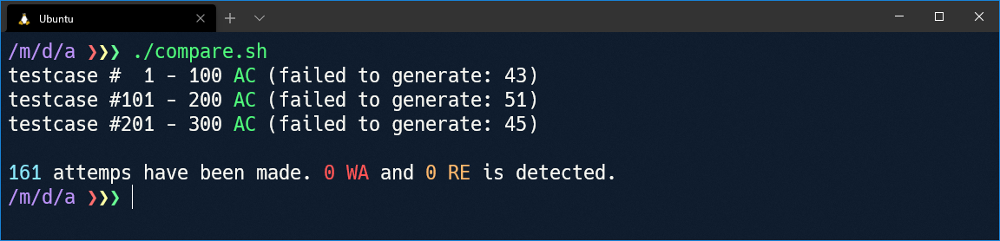
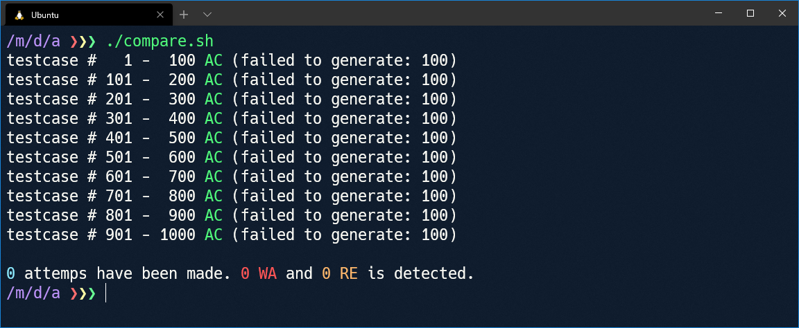
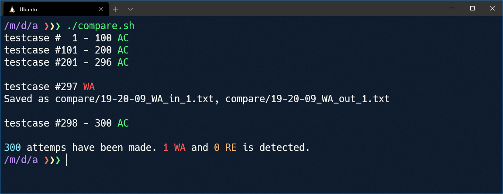
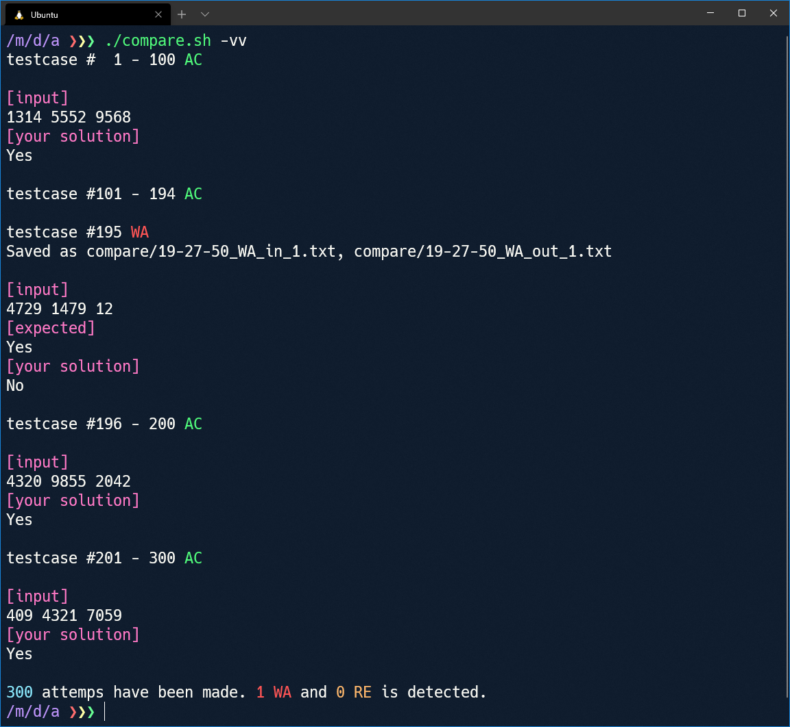
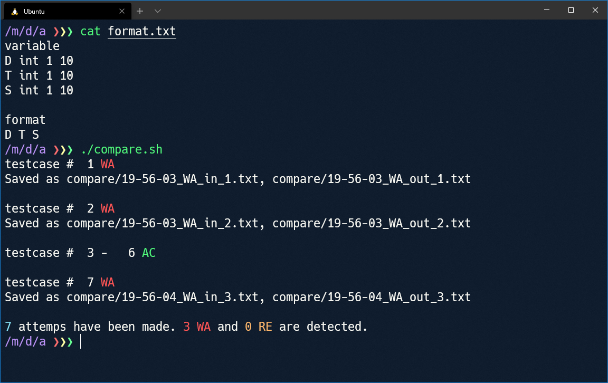

# その他の注意点

## テストケースの生成が成功しているか確認する

以下のようなテキストファイルからテストケースを生成した場合、50% の確率でテストケースの生成に失敗します。

```
variable
N int 1 4
M int(<N) 2 4

format
N M
```

- `N` が 1 のとき、`N` より小さい `M` の値は作れません。
- `N` が 2 のとき、`N` より小さい `M` の値は作れません。
- `N` が 3 のとき、`M` は 2 になります。
- `N` が 4 のとき、`M` は 2 または 3 になります。

このように、構文に誤りがなくても生成された乱数によってテストケースが作れないことがあります。スクリプトが永遠に終了しなくなることを避けるため、テストケースの生成に失敗した場合でも 1 回の試行として数えられます。

このとき、スクリプトの出力は以下の画像のようになります。300 回の試行のうち 161 回しかテストケースの生成に成功していません。



出力が以下の画像のようになった場合はテストケースが全く生成されていません。スクリプトを再度実行する前に、フォーマットのテキストを書き直してください。



## 問題通りの制約を書かない

愚直解は効率の悪いアルゴリズムであるため、問題通りの制約でテストケースを生成すると実行にとても長い時間が掛かります。そこで、問題の制約よりも小さい制約でテストケースを生成する必要があります。特に、数百回という単位の試行を行うことを考えると「一瞬」で実行が終了するような制約を設定する必要があります。

また、あまり大きい数が並んでいるテストケースを作ると WA を検出できても何故 WA になったのか自分の頭で考えることが難しくなります。

これらの理由から、生成するテストケースの制約は実際の問題よりも小さくすることをおすすめします。

## サンプルケースのようなテストケースが生成されることを期待しない

[ABC 177 - A Don't be late](https://atcoder.jp/contests/abc177/tasks/abc177_a) を例に説明します。

`D`, `T`, `S` が入力として与えられ、 であるかどうか判定して `Yes` または `No` を出力するとこの問題に正解することができます。

例えば、以下のようなコードは[正解](https://atcoder.jp/contests/abc177/submissions/16743936)となります。このコードを `solution_2.py` とします。

```python
D, T, S = map(int, input().split())
print("Yes" if D <= T * S else "No")
```

このコードを少し改変して、条件式の中の  を 5 倍にしてみます。

```python
D, T, S = map(int, input().split())
print("Yes" if D * 5 <= T * S else "No")
```

当然、これは[不正解](https://atcoder.jp/contests/abc177/submissions/16743961)となります。このコードを `solution_1.py` とします。

[ここ](https://github.com/naskya/testcase-generator/blob/master/document/input_file_syntax.md#%E4%BE%8B-1-abc-177---a-dont-be-late) に書いたように、この問題のテストケースを生成するテキストは

```
variable
D int 1 10000
T int 1 10000
S int 1 10000

format
D T S
```

となります。これを `format.txt` とします。

このテキストを `generator.out` に入力することでテストケースを生成し、`solution_1.py` と `solution_2.py` の出力を比較してみます(`solution_1.py` は問題に記載されているサンプルケースすら通らないので、本来このようなことをする必要はありません)。

```bash
alias testcase_generator="./generator.out < ./format.txt"
alias your_solution="python3 ./solution_1.py"
alias naive_solution="python3 ./solution_2.py"

declare -i max_number_of_attempts=300
declare -i max_number_of_WA_or_RE=3
```

`D` を 5 倍にした解答が通るはずはないので、すぐに WA となるケースが見つかることでしょう。



……実行してみると、300 回もテストケースを試して 1 つしか WA となるケースを見つけることができませんでした。これはソフトウェアの不具合ではありません。

何故このようなことが起きたのか考えるため、今度は `./compare.sh -vv` を実行してみます。



AC と表示されているすべてのケースで答えが `Yes` となっていて、答えが `No` となるケースがあまり生成されていないことが予想されます。1 以上 10000 以下の範囲で数を 3 つランダムに生成して 1 つの数が他の 2 数の積以下であるか判定しているため、これは当然のことです(平均的には  であり、このとき  は圧倒的大差で真)。

そのため  を 5 倍にした程度では多くの場合で結果が変わらず、WA として検出されませんでした(実際、AtCoderでの[提出結果](https://atcoder.jp/contests/abc177/submissions/16743961)でもランダムなケースはすべて通っていることが確認できます)。

このように、サンプルケースではあっさり落ちる解もランダムなケースではなかなか落ちない場合があります。これは、サンプルケースがよく考えて作られた特殊なケースであるからです。

同じように「コーナーケースで落とされるけれど、ランダム生成したテストケースでは全然 WA にならない」ということはよく起きます。このような場合、試行回数を増やして「数打ちゃ当たる」を信じてみたり、どのようなケースで落ちるのかをよく考えて制約を設定し、怪しい部分を重点的に攻めてみたりするなど色々な方針が考えられます。

実際、先ほど示した例では `D`, `T`, `S` の制約を 1 以上 10 以下などに狭めることによってあっさり落とすことができます。



ランダムにテストケースを生成して解を比較する方法はとても強力ですが、それを過信せずに自分の解がどうして通らないのかしっかりと考えることは大切です。
